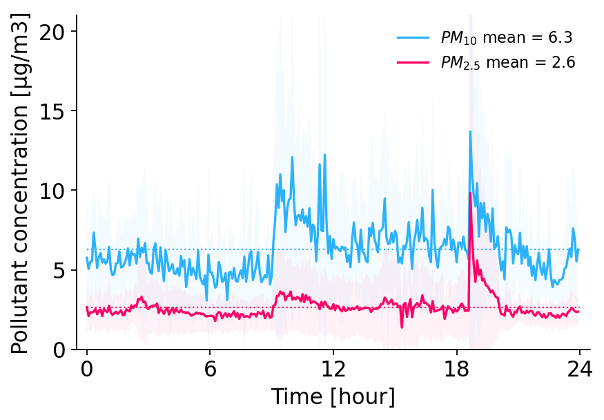

# py-air-quality
Measure and analyse air particulate concentration using a Raspberry Pi and a
[Nova Fitness SDS011 particulate sensor](https://www.berrybase.de/en/sensors-modules/gas-dust/nova-fitness-sds011-feinstaub-sensor-inkl.-usb-adapter).



## Part 1 - Measure & plot air particulate concentration  

Follow these instructions to continuously measure and plot the air particulate
concentration.   From the bash command line, create a directory, and clone this
repository:
```bash
mkdir /home/pi/github
cd /home/pi/github
git clone https://github.com/ingo-m/py-air-quality
```

Create another folder, where measurement data will be saved:
```bash
mkdir /home/pi/air_quality
```

Create a virtual python environment, activate the environment, and install all
necessary dependencies:
```bash
python3 -m venv /home/pi/py_main
source /home/pi/py_main/bin/activate
pip install numpy pandas seaborn fastapi aiofiles uvicorn pyserial py-sds011
```

Connect the SDS011 particulate sensor to one of your Raspberry Pi's USB ports.

To continuously measure the concentration of air particulates every 5 minutes,
we can use cron tab. You can read an introduction to cron tab [here](https://linuxiac.com/how-to-use-cron-to-schedule-tasks-the-complete-beginners-guide/).

Open crontab from the bash command line:
```bash
crontab -e
```

If this is the first time you opened crontab, you might be asked which editor
you would like to use. I would recommend `nano`.

Scroll to the bottom of the document (by pressing `↓`), and paste the following
two lines. If you selected the `nano` text editor in the previous step, you can
paste by pressing `Ctrl` + `Shift` + `v` at the same time. The first line will
schedule a new measurement every 5 minutes, and the second line will refresh the
plots with the results.
```bash
*/5 * * * * /home/pi/py_main/bin/python /home/pi/github/py-air-quality/py_air_quality/measurement/sds011.py
*/5 * * * * /home/pi/py_main/bin/python /home/pi/github/py-air-quality/py_air_quality/analysis/plot_pollution.py
```
Leave the text editor by pressing `Ctrl` + `x` (at the same time), followed by
`y` and `Enter`.

You can inspect the cron tab (view only) like this:
```bash
crontab -l
```

By default, the measurement data will be written into a text file located at
`/home/pi/air_quality/baseline_measurement.csv`. With every measurement, a new
line will be appended. The file contains three columns, separated by `,`. The
first row is an epoch time stamp (an easy-to use time format, see [Wikipedia](https://en.wikipedia.org/wiki/Epoch_(computing))
for more information). The epoch time stamp is often easier to use when
analysing data, and can be converted into a human-readable time format when
plotting the data.

There are three separate plots showing:
- The air particulate concentration over the last 24 hours
(`baseline_last_24_h.png`)
- The mean air particulate concentration since the measurement started for
weekdays (i.e. Monday to Friday, `baseline_weekday.png`)
- The mean air particulate concentration since the measurement started for
weekends (i.e. Saturday and Sunday, `baseline_weekend.png`)

For more background information, see:
- https://github.com/ikalchev/py-sds011
- https://www.raspberrypi.org/blog/monitor-air-quality-with-a-raspberry-pi/
- https://openschoolsolutions.org/measure-particulate-matter-with-a-raspberry-pi/

## Part 2 - Show plots on other devices (optional)

At this point, you are able to continuously measure the air particulate
concentration, and inspect the resulting plots, which are updated automatically.
If you would like to be able to easily view the most recent plots on other
devices on your local network (another computer, or your phone) in a web
browser, follow the next steps.

Please note that the plots will only be  accessible to devices logged into the
same local network, i.e. via the same router, for security reasons. Making them
available to the public internet is possible, but more complicated.

Install `tmux` from the bash command line:
```bash
sudo apt-get update
sudo apt-get upgrade
sudo apt-get install tmux
```

Check your Raspberry Pi's IP address:
```bash
hostname -I
```
This might output a long string of characters; we are only interested in the
first block, which looks like this: `123.456.7.890` (your actual number will be
different).

Start the server that will make the plots available on your local network like
this, after adjusting the IP address with the one from the previous step:
```
tmux
cd /home/pi/github/py-air-quality/py_air_quality/server/
uvicorn server:app --host 123.456.7.890
```
The first command (`tmux`) starts a separate terminal session that you can leave
without terminating the process (so that the server stays on). Exit the tmux
session by typing `Ctrl` + `b` and `d`.

You can now view the plots in a normal web browser, from any other device on
your local network, at these URLs (adjust the IP to the Raspberry Pi's address
from the previous step):
- http://123.456.7.890:8000/last_24_h
- http://123.456.7.890:8000/weekday
- http://123.456.7.890:8000/weekend

You can leave the server permanently active, it consumes practically no system
resources when running in the background. If you would like to shut down the
server at some point, you first have to re-connect to the tmux session:
```bash
tmux attach
```
Now you can terminate the server process by pressing `Ctrl` + `c`, and end the
tmux session:
```bash
exit
```

If you are not sure whether the server is still running, you can list active
tmux session like this:
```bash
tmux ls
```
